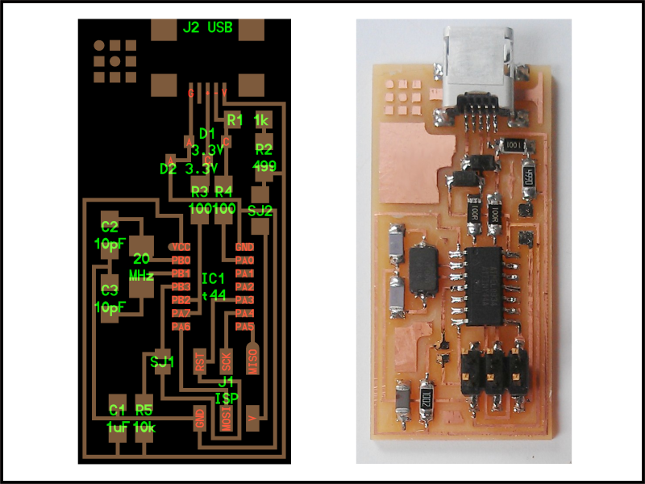
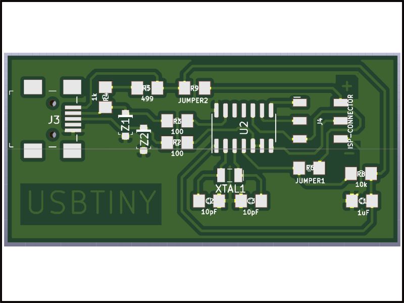

# FabISP-USBtinyISP-ATtiny44
This is a version of the FabISP programmer that is used in the Fab Academy course around the world based on the board [hello.ISP.44](http://academy.cba.mit.edu/classes/embedded_programming/index.html#programmers).

The FabISP is an in-system programmer for AVR microcontrollers, designed for production within a FabLab. That is, it allows you to program the microcontrollers on other boards you make, using nothing but a USB cable and 6-pin IDC to 6-pin IDC cable. It's based on the [USBtiny](https://dicks.home.xs4all.nl/avr/usbtiny/) and [V-USB](www.obdev.at/products/vusb/) firmwares, which allow the ATtiny44 to perform USB communication in software. Programming can be done through avrdude. 

This version was made using the [software KiCad version 5.1.2](https://kicad.org/)

[Download-Project](USBtiny-ISP-Programmer-ATtiny44/USBtiny-ISP-Programme-ATtiny44.pro)

## Schematic

[Download-schematic](USBtiny-ISP-Programmer-ATtiny44/USBtiny-ISP-Programme-ATtiny44.sch)

## BOM

Item|Qty|Reference(s)|Value|LibPart|Footprint|Datasheet|Category
-|-|-|-|-|-|-|-
1	|1	|C1	|1uF	|SparkFun-Capacitors:1.0UF-1206-50V-10%	|1206
2	|2	|C2, C3	|10pF	|SparkFun-Capacitors:1.0UF-1206-50V-10%	|1206
3	|1	|J3	|690-005-299-043	|dk_USB-DVI-HDMI-Connectors:690-005-299-043	|digikey-footprints:USB_Mini_B_Female_690-005-299-043	|http://files.edac.net/690-005-299-043.pdf	|Connectors, Interconnects
4	|1	|J4	|ISP-CONNECTOR	|SparkFun-Connectors:CONN_03X2FEMALE_SMD	|2X3_SMD
5	|2	|R2, R3	|100	|SparkFun-Resistors:10OHM-1206-1_4W-1%	|1206
6	|1	|R4	|1k	|SparkFun-Resistors:10OHM-1206-1_4W-1%	|1206
7	|1	|R5	|499	|SparkFun-Resistors:10OHM-1206-1_4W-1%	|1206
8	|1	|R6	|JUMPER1	|SparkFun-Resistors:10OHM-1206-1_4W-1%	|1206
9	|1	|R8	|10k	|SparkFun-Resistors:10OHM-1206-1_4W-1%	|1206
10	|1	|R9	|JUMPER2	|SparkFun-Resistors:10OHM-1206-1_4W-1%	|1206
11	|1	|U2	|ATtiny44-20SSU	|MCU_Microchip_ATtiny:ATtiny44-20SSU	|Package_SO:SOIC-14_3.9x8.7mm_P1.27mm	|http://ww1.microchip.com/downloads/en/DeviceDoc/doc8006.pdf
12	|1	|XTAL1	|ECS-_327-12_5-34B-TR	|dk_Crystals:ECS-_327-12_5-34B-TR	|digikey-footprints:SMD-2_3.2x1.5mm	|http://www.ecsxtal.com/store/pdf/ecx-31b.pdf	|Crystals, Oscillators, Resonators
13	|2	|Z1, Z2	|3V3	|dk_Diodes-Zener-Single:MMSZ5231B-7-F	|digikey-footprints:SOD-123	|https://www.diodes.com/assets/Datasheets/ds18010.pdf	|Discrete Semiconductor Products

## Interactive BOM

This tool can help you during the soldering process.
It is a HTML file called [ibom.html](USBtiny-ISP-Programmer-ATtiny44/bom/ibom.html)

## Board Layout 

[Download-Board-Layout](USBtiny-ISP-Programmer-ATtiny44/USBtiny-ISP-Programmer-ATtiny44.kicad_pcb)

## Fabrication Files

[Download-Gerbers](USBtiny-ISP-Programmer-ATtiny44/Gerber/USBtiny-ISP-Programme-ATtiny44-Gerber.zip)

## 3D view

[Download-3D-Model](USBtiny-ISP-Programmer-ATtiny44/3D-Model/USBtiny-ISP-Programmer-ATtiny44.step)

## Programming Instructions

The instructions to program the board is this [website](http://archive.fabacademy.org/archives/2016/doc/programming_FabISP.html) or in a PDF file [here](USBtiny-ISP-Programmer-ATtiny44/Firmware-Instructions/USBtiny-ISP-Programmer-ATtiny44-ProgrammingInstructions.pdf)

To download the firmware you can go [here](http://academy.cba.mit.edu/classes/embedded_programming/firmware.zip) or download from [here](USBtiny-ISP-Programmer-ATtiny44/Firmware-Instructions/firmware.zip)

The toolchain for programming you can download from:
- [Ubuntu](http://ubuntuhandbook.org/index.php/2017/01/install-avrdude-6-4-ubuntu-16-04/)
- [Mac OS](https://www.ladyada.net/learn/avr/setup-mac.html)
- [Windows](https://www.ladyada.net/learn/avr/setup-win.html)

## Usage

Once you programmed your FabISP you want to try if it works, so, if you are using Microsoft Windows you will need a [driver.](https://learn.adafruit.com/usbtinyisp/drivers)

